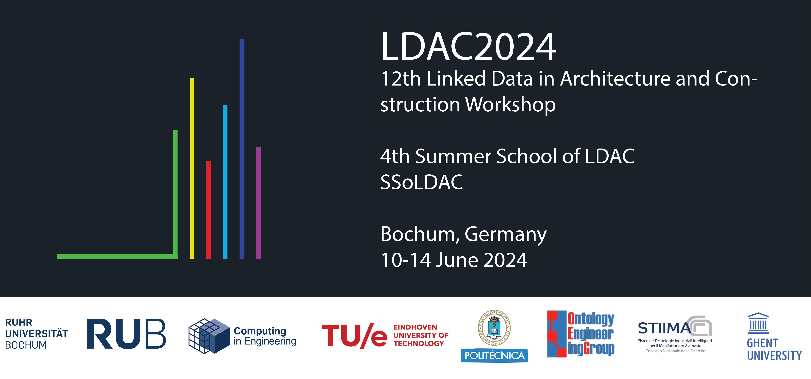

# SSoLDAC - session hands-on querying and interaction

This repository contains documentation and source for the hands-on session 'querying and interaction' that takes place in the [4th Summer School of Linked Data in Architecture and Construction](http://linkedbuildingdata.net/ldac2024/summerschool/) held on 10 - 12 June in Bochum, Germany. 

This repository is loosely based on the repository that was created in 2019 for the first Summer School of LDAC in Lisbon, and which is available here: (https://github.com/jakob-beetz/SummerSchoolOfLDAC/). Check license terms for open re-use.

## Getting Started
Please move to [Index](0_Index.ipynb) to start working with the material of this repository. You can also launch the content by opening it in Google Colab:  

The content of this summer school is distributed using [Jupyter](https://jupyter.org/) notebooks. You can open and use them as follows:

1. Open the notebooks in Github by simply clicking on them in the browser. In this case, scripts cannot be executed live.
2. Open the notebooks one by one in Google Colab and execute the scripts there.
3. Download the notebooks and open them in MS Visual Studio Code. Do this by ['opening folder'](https://youtu.be/u3PMR8voOo0?si=ZgVuWCp2iVE15hb8). 

## Dependencies
This repository assumes the following software to be installed:
- Python 3.9.0 or higher
- OntoText GraphDB

Key used python packages (install using `pip install`)
- IfcOpenShell v 0.7.0
- rdflib
- owlrl
- pandas
- requests

## Data
We store some open data in the [data](data) folder of this repository. Feel free to use these according to the given license terms.

- 7m900_tue_hello_wall_with_door.ttl
- 7m900_tue_hello_wall_with_door.ifc
- Atlas_8_floor.ifc
- Atlas_8_floor.rvt
- Atlas_8_floor.ttl
- buildingmodel.rvt
- simplebuilding.csv
- simplebuilding.xlsx
- smallhouse.ifc
- smallhouse.ttl

## Authors
This repository is built by:
* **Pieter Pauwels**, Eindhoven University of Technology [profile](https://research.tue.nl/en/persons/pieter-pauwels/)  

## License

### Code
All source code provided in this repository is licensed under the [MIT license](LICENSE-CODE).

### Text
The textual description in the notebooks and all other content which is not source code is licensed under the [CC-BY-SA-4.0](LICENSE-TEXT) license.
